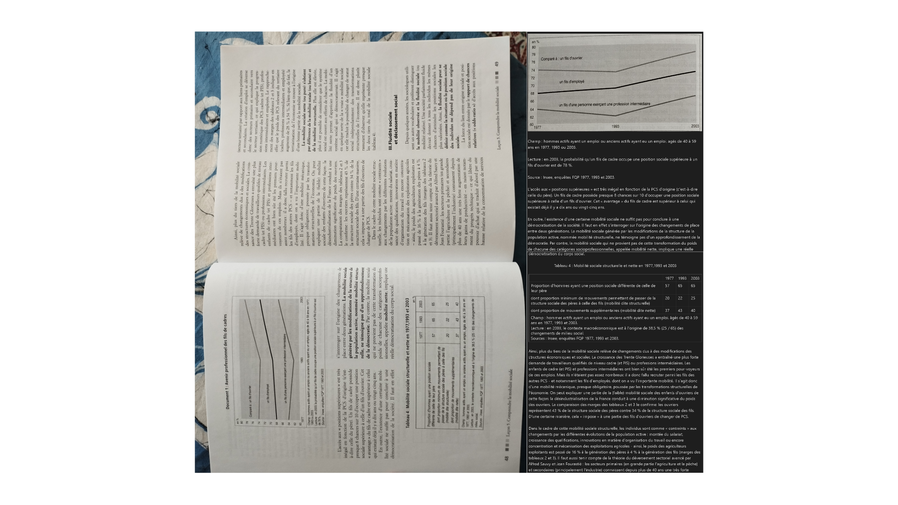

# ocr-book — Book OCR Pipeline → Markdown

Digitizes an entire book into Markdown from page photos, PDFs, or EPUBs,
using **PaddleOCR-VL-1.5** via **llama-server** (local inference).

---

## Prerequisites

- [miniforge](https://github.com/conda-forge/miniforge) or Anaconda
- [llama-server](https://github.com/ggerganov/llama.cpp) (Vulkan recommended on Windows)
- GGUF model: [PaddleOCR-VL-1.5-GGUF](https://huggingface.co/PaddlePaddle/PaddleOCR-VL-1.5)

---

## Installation

```bash
python setup.py
conda activate ocr-livre
```

Then configure the paths to `llama-server` and the models. The easiest way is to copy `.env.example` to `.env` and edit it, but you can also use environment variables or CLI arguments — see [docs/SETUP.md](docs/SETUP.md) for all options.

```bash
cp .env.example .env
# Edit .env and set LLAMA_SERVER_PATH, MODEL_PATH and MMPROJ_PATH
```

---

## Project Structure

```
ocr-livre/
├── src/
│   ├── main.py          # CLI entry point
│   ├── config.py        # Central configuration (dataclass)
│   ├── ocr_client.py    # OCR of an image via PaddleOCRVL
│   ├── postprocess.py   # OCR text cleanup
│   ├── obsidian.py      # Obsidian export (wikilinks, migration)
│   ├── images.py        # Image collection and renaming
│   ├── pipeline.py      # Full orchestration
│   ├── progress.py      # Logging and statistics
│   ├── pdf.py           # PDF processing (text extraction or render → OCR)
│   └── epub.py          # EPUB extraction (Pandoc-based)
├── docs/
│   ├── architecture/    # Architecture documentation
│   ├── dev/             # Patches and development notes
│   ├── SETUP.md         # Installation instructions
│   ├── tested.md        # Experiment results
│   └── issues.md        # Work in progress
├── photos/              # Source images (one per page)
├── output/              # Generated Markdown + logs + figures
├── environment.yml      # Conda dependencies
└── setup.py             # Automated installation script
```

---

## Usage

Run from the project root:

```bash
# Default pipeline (photos in ./photos, output output/book.md)
python main.py

# Specify folders
python main.py --images ./my_photos --out output/my_book.md

# PDF input
python main.py --images ./book.pdf --out output/book.md

# EPUB input
python main.py --images ./book.epub --out output/book.md

# Without layout detection
python main.py --no-layout

# Restart from the beginning
python main.py --no-resume

# Detailed logs
python main.py --verbose

# Dense tables — increase context if tables are truncated
python main.py --n-ctx 12288 --n-parallel 3
```

---

## Example

A phone photo of a textbook page — charts, tables, and dense text — converted to clean Markdown in one command.



*Left: original page photo. Right: extracted Markdown rendered.*

---

## PDF Processing

PDFs are automatically classified as **text-based** (native text layer) or **image-based** (scanned).

- **Text-based**: extracts text natively with `pymupdf`, detects figures with layout model, no VLM OCR.
- **Image-based**: renders pages to images, then runs the normal OCR pipeline.

Choose the extraction method explicitly:

```bash
python main.py --images ./book.pdf --method text         # fast, native text only
python main.py --images ./book.pdf --method docling      # structured extraction
python main.py --images ./book.pdf --method paddleocrvl  # best quality, slowest
```

---

## EPUB Extraction

EPUBs are converted to Markdown via Pandoc, with embedded figures extracted automatically.

```bash
python main.py --images ./book.epub --out output/book.md
```

---

## Obsidian Export

In `obsidian` mode, the pipeline:
- converts figures to wikilinks `![[Files/image.jpg]]`
- saves the `.md` directly into the vault
- copies figures to `vault_path/vault_figures_dir/`

Configure `vault_path` and `vault_figures_dir` in `config.py`, then:

```bash
# Full OCR + obsidian export
python main.py --mode obsidian

# Re-apply obsidian postprocess without re-running OCR
python main.py --mode obsidian --postprocess-only

# Migrate figures to the vault only
python main.py --migrate
```

---

## Image Renaming

```bash
# Preview without modifying
python main.py --rename --dry-run

# Rename for real (→ page_001.jpg, page_002.jpg, …)
python main.py --rename

# Rename without running OCR
python main.py --rename-only

# Process subfolders by chapter
python main.py --rename-only --chapters "Chapter 1" "Chapter 2"
```

---

## Automatic Resume

If the pipeline is interrupted, simply re-run:

```bash
python main.py
```

Already processed pages are automatically skipped.

---

## Full Options

```
--images PATH              Photo folder, PDF, or EPUB       (default: ./photos)
--out FILE                 Output Markdown file             (default: output/book.md)
--llama-server PATH        Path to llama-server executable  (env: LLAMA_SERVER_PATH)
--model PATH               Path to model .gguf              (env: MODEL_PATH)
--mmproj PATH              Path to mmproj .gguf             (env: MMPROJ_PATH)
--mode {base,obsidian}     Output mode                      (default: base)
--method {text,docling,paddleocrvl}  PDF extraction method  (default: paddleocrvl)
--no-layout                Disable layout detection
--no-resume                Restart from the beginning
--no-postprocess           Raw output without cleanup
--postprocess-only         Obsidian postprocess without OCR  (requires --mode obsidian)
--migrate                  Copy figures to the vault        (requires vault_path configured)
--dry-run                  Simulate without modifying
--verbose                  DEBUG logs
--rename                   Rename images before OCR
--rename-only [N]          Rename without running OCR       (N = starting number)
--rename-prefix P          Rename prefix                    (default: page)
--chapters NAME…           Subfolders to process (in order)
--dir-level                Folder-level order for --rename
--max-tokens N             Max tokens generated per page    (default: 4096)
--n-ctx N                  KV cache size (context window)   (default: n-parallel × 2048)
--n-parallel N             Intra-page parallel slots        (default: 1, >1 needs the parallel patch)
--n-threads N              CPU threads for llama-server     (default: 4)
--n-servers N              Parallel llama-server instances  (default: 1)
--no-kv-offload            Disable KV cache GPU offload
```

---

## Exit Codes

| Code | Meaning                                      |
|------|----------------------------------------------|
| 0    | Full success                                 |
| 1    | Fatal error                                  |
| 2    | Finished with errors on some pages           |
